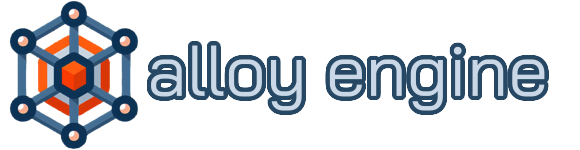

# 

[![Build]][build-workflow]
![License]

🚧 This is an experimental game engine written in Rust, that aims to rewrite
my engine [previously started in C++ by the same name][alloy_cpp],

It is inspired by many great open-source projects that
have come before it, the complete list can be seen
[below](#inspirations).

## Quick References

* [📚 Book](https://bitwizeshift.github.io/alloy-rs/book/) \
  A quick pocket-guide to using this project
* [📄 Cargo Docs](https://bitwizeshift.github.io/alloy-rs) \
  For generated rust docs
* [🚀 Contributing](.github/CONTRIBUTING.md) \
  How to contribute to this project
* [💼 License](#license) \
  Information about the licensing for this project

## Inspirations

**Alloy** was inspired by a variety of existing open-source projects.
Some of these projects are listed below:

* [Godot](https://github.com/godotengine/godot)
* [Blade](https://github.com/crazii/blade)
* [Ogre](https://github.com/OGRECave/ogre/pulls)
* [Nomad](https://github.com/taurheim/NomadECS)
* [easy-engine](https://github.com/callebstrom/easy-engine)

**Note:** _inspired_ does not mean that any code was taken without following
proper license attribution. It simply means that certain designs and concepts
may have been adjusted to align with what other existing projects are
already doing.

## License

Except where otherwise specified, this project is dual-licensed under both the
[Apache-2] and [MIT] licenses.

[Apache-2]: https://opensource.org/license/apache-2-0/
[MIT]: http://opensource.org/licenses/MIT/
[Build]: https://img.shields.io/github/actions/workflow/status/bitwizeshift/alloy-rs/.github%2Fworkflows%2Fbuild.yaml
[build-workflow]: https://github.com/bitwizeshift/alloy-rs/actions/workflows/build.yaml
[License]: https://img.shields.io/github/license/bitwizeshift/alloy-rs
[alloy_cpp]: https://github.com/bitwizeshift/alloy
