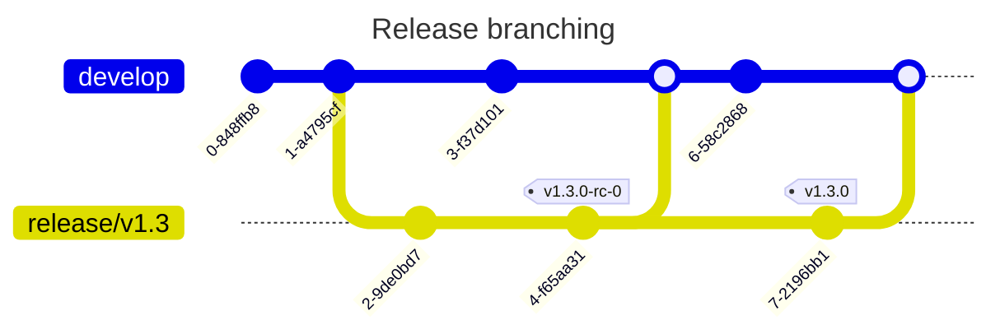
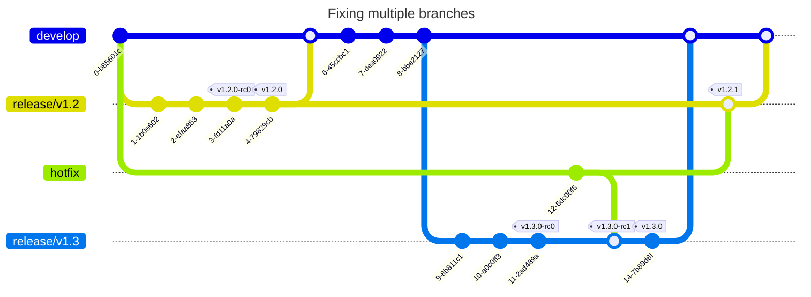

# Branch Strategy

## Development

Since this project is a sole-authorship, the current branching strategy is to
leverage the `develop` branch for active development, and to use a companion
[GitHub workflow] that will automatically verify and promote these changes back
to `master` provided that they build and test correctly. Promotion is done
via [fast-forwarding] to preserve [signed git commits].

In some cases, larger features will be developed as separate branches so that
the changes can be included and identified by the totality of the branch, rather
than by scanning individual commits.

[signed git commits]: https://git-scm.com/book/en/v2/Git-Tools-Signing-Your-Work
[Github workflow]: https://github.com/bitwizeshift/alloy-rs/actions/workflows/deploy-master.yaml
[fast-forwarding]: https://git-scm.com/book/en/v2/Git-Branching-Basic-Branching-and-Merging

## Releases

The strategy for creating releases is to first create a `release/{version}`
branch where work that is dedicated to a release will be pushed to, following
a similar strategy as for normal [development](#development). The branch name
identifies the `major.minor` semantic version, but _not_ the patch. Both the
patch version and release-candidates will be identified in [annotated tags] and
[GitHub releases].

[annotated tags]: https://git-scm.com/book/en/v2/Git-Basics-Tagging
[GitHub releases]: https://github.com/bitwizeshift/alloy-rs/releases

Work identified for the release will be made onto this branch, and will merge
back into `develop` and promoted to `master` to keep the two branches
synchronized.

Once a final non release-candidate build is decided, an [annotated tag] and
[GitHub release] will be created marking the `vX.Y.0` version. At this point,
the release branch is left only for patch fixes/bug-fixes, but will **no longer
be merged back in to develop** as it is no longer the actively maintained branch.

[annotated tag]: https://git-scm.com/book/en/v2/Git-Basics-Tagging
[GitHub release]: https://github.com/bitwizeshift/alloy-rs/releases

### Hotfixes and Patches

Patches will _NOT_ use the `cherry-pick` strategy, as this causes duplicate
commits with the same content when merging release branches back into
`develop`/`master`. Instead, to keep branches up-to-date and to accurately
reflect the state of fixes, a _new_ branch created at the **common ancestor**
of the affected release branch(es) will be created. This branch will be merged
into the afflicted release branches with a normal merge strategy, resolving any
conflicts in the merge commit.

If there is an active release branch for which a non release-candidate has been
created, the normal process outlined above is followed, where the release branch
will merge back in to `develop` and continue as normal. If there is no active
release branch, the fix will be merged into `develop` directly.

Using this strategy allows the SHA1 of the initial fix to be checked against the
release branch to verify that the fix has indeed been introduced into previous
releases. The standard `cherry-pick` method does not allow for this, and often
introduces divergent code when conflicts arise; leading to release branches with
no real guarantee of correctness.
